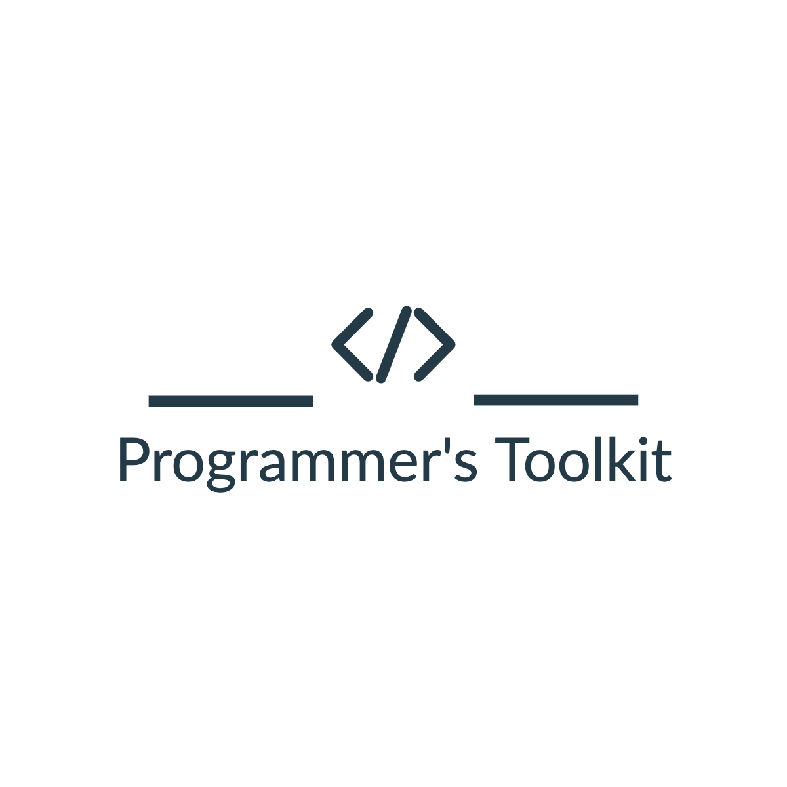

### 

## Table of Contents
###
* [Description](#description)
* [Links](#links)
* [Credits](#credits)
* [Licenses](#licenses)
* [Contributors](#contributors)

 

## Description
 The Programmer's Toolkit was created to help developers, engineers, and the curious create, fix, and update their code using ChatGPT. 
- Ask ChatGPT your question and store your code in your "toolkit".
- Revisit previous ChatGPT searches as needed.
                
 

## Links
<!-- need to add deployed site url here --> Deployed Site
 
<a href="https://github.com/MagicCrouton/programmersToolkit"> GitHub </a> 

 

## Credits
- Chat GPT
- Open AI

 

## Licenses
- ISC

 

## Contributors
- Konny Ho
 
- Eugene Park
 
- Tim Aspesberro
 
- Mark Green

<!-- 
<<<<<<< HEAD
=======
<<<<<<< HEAD
=======

Konny, Tim, Mark, Eugene
>>>>>>> 7b562d1dcbd017129b3e30c52dd176d6535f9399
>>>>>>> 339893b284f87017a9ad436521771a012363e729 -->
